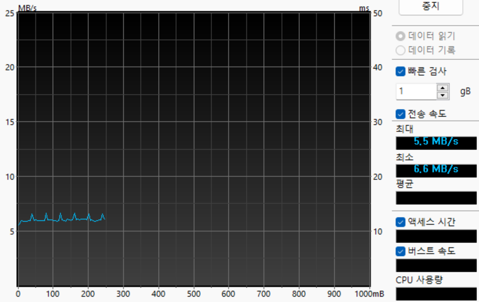
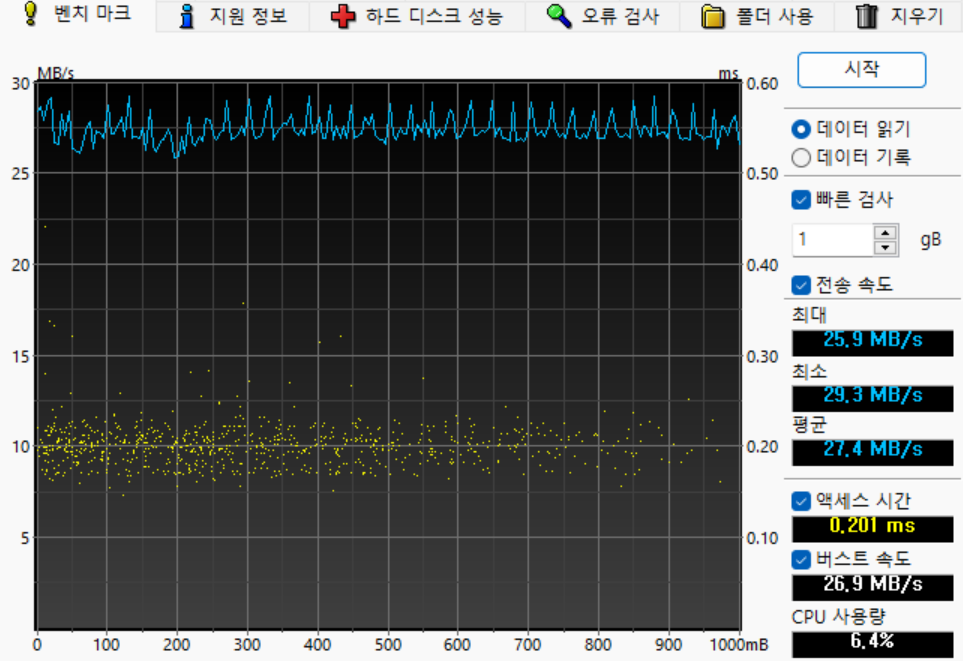
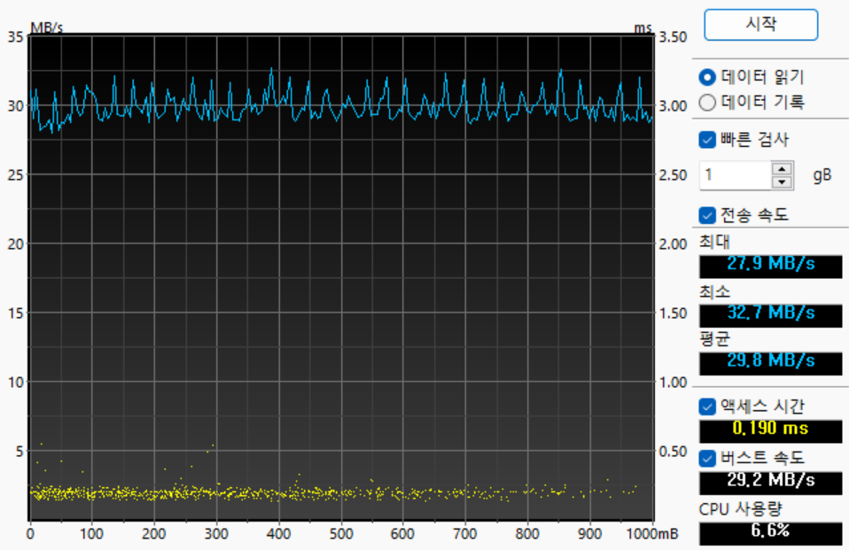
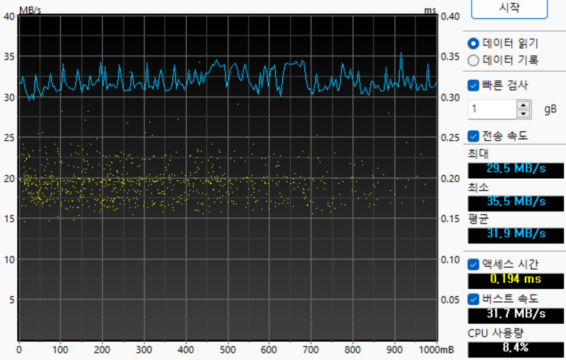
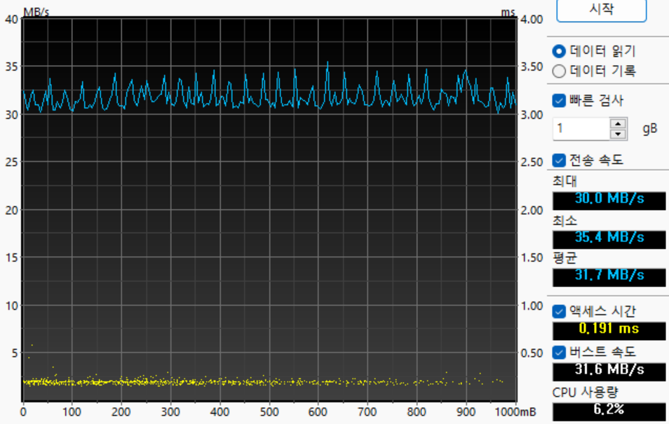
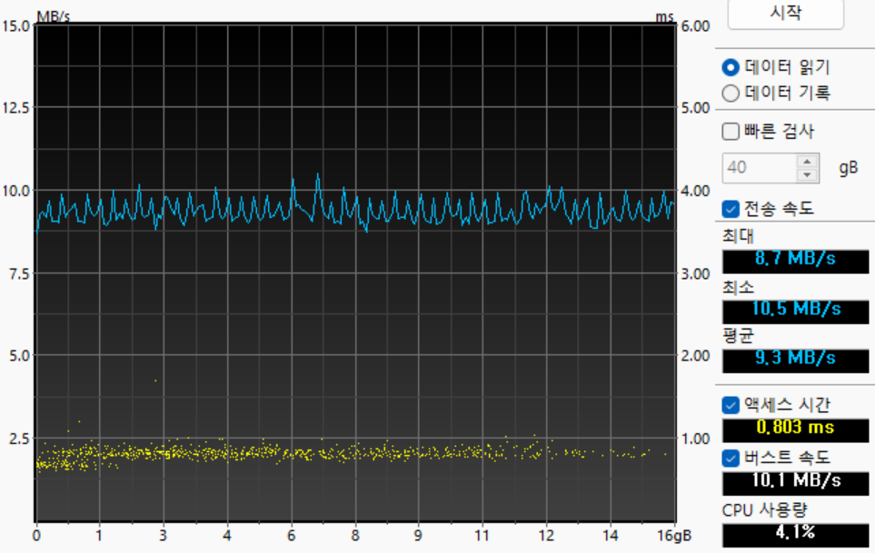
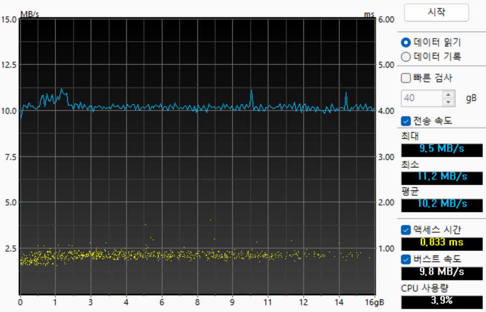

# USB-SDCard MSD 예제 및 연구

본 프로젝트는 MIMXRT1020-EVK (RT1021) 를 통해 SDCard 를 Storage 로 사용하는 Mass Storage Device 를빠른 속도로 동작하는 것을 목표로 합니다.


5278a50 commit 까지는 Teensy 4.1 (RT1062) 를 사용하였습니다.

```
* 저는 Teensy 4.1 보드를 사용합니다.
* evkbmimxrt1060 보드 또한 사용 가능할 것으로 예상합니다.
```

# 여러 시도들

## 1. 최초 속도 테스트



* 기본 소스
* 5.5 ~ 6.6 MiB/s (avg. 6.05MiB/s)

## 2. USB-Only 속도 테스트

usb_sdcard_adapter.c 에서 `USB_Disk_ReadBlocks` 함수를 아래와 같이 SD카드를 사용하지 않도록 변경한다.

```c
status_t USB_Disk_ReadBlocks(uint8_t *buffer, uint32_t startBlock, uint32_t blockCount)
{
	return kStatus_Success;
    // return SD_ReadBlocks(usbDeviceMscSdcard, buffer, startBlock, blockCount);
}
```

### 2.1. 배경 지식

USB 2.0 High-Speed 의 경우

* Bulk 로 한번에 512 bytes 전송이 가능하다.
* microframe 은 125 uS 이다. 따라서 1s / 125us = 8000 microframes/sec
* 보통 8개 ~ 이론상 최대 13개의 bulk를 한번의 microframe에 전송 가능하다.
* 8(bulk) * 512(block) * 8000 = 31.25MB/s
* 13(bulk) * 512(block) * 8000 = 50.78MB/s

### 2.2. 기본 상태



* 읽기 버퍼(`USB_DEVICE_MSC_READ_BUFF_SIZE`) : 512 * 8 = 4096 bytes
* 평균 27.4 MiB/s
* 1s / 0.201ms = 4975
* 27.4MB / 4975 / 512 = 11.27
* 27.4MB / 8000 / 512 = 7.0144

### 2.3. 읽기 버퍼 크기 변경 (512 * 13)



* 읽기 버퍼(`USB_DEVICE_MSC_READ_BUFF_SIZE`) : 512 * 13 = 6656 bytes
* 평균 29.8 MiB/s
* 1s / 0.201ms = 5263
* 29.8MB / 4975 / 512 = 12.26
* 27.4MB / 8000 / 512 = 7.62

### 2.4. 읽기 버퍼 크기 변경 (512 * 26) => 최적



* 읽기 버퍼(`USB_DEVICE_MSC_READ_BUFF_SIZE`) : 512 * 26 = 13312 bytes
* 평균 31.9 MiB/s
* 1s / 0.194ms = 5154
* 31.9MB / 5154 / 512 = 12.67
* 31.9MB / 8000 / 512 = 8.17

### 2.5. 읽기 버퍼 크기 변경 (512 * 54)



* 읽기 버퍼(`USB_DEVICE_MSC_READ_BUFF_SIZE`) : 512 * 54 = 26624 bytes
* 평균 31.7 MiB/s
* (512 * 26) 와 별 차이 없음
* 1s / 0.191ms = 5235
* 31.7MB / 5235 / 512 = 12.4
* 31.9MB / 8000 / 512 = 8.12

프레임 개수를 측정해보고 싶은데 USBPCap가 안깔린다... 그래서 대략 예상해본 값... 계산 방법이 맞는진 모르겠다.

## 3. SD-Only 테스트

```c
#define TEST_BLOCK_COUNT 1
uint8_t buffer[512 * TEST_BLOCK_COUNT];
extern sd_card_t *usbDeviceMscSdcard;
void SDCardTest() {
	int st = xTaskGetTickCount();
	int dt;
	for (int i=0; i<16384; i+=TEST_BLOCK_COUNT) {
	    SD_ReadBlocks(usbDeviceMscSdcard, buffer, i, TEST_BLOCK_COUNT);
	}
	dt = xTaskGetTickCount() - st;
	PRINTF("TIME = %d ms\n", dt);
}
```

* 16384 * 512 = 총 8 MiB 테스트

### 3.1. TEST_BLOCK_COUNT 가 1 일 때

```
TIME = 5168 ms
```

* 8MiB / 2.617 = 1.548 MiB/s

### 3.2. TEST_BLOCK_COUNT 가 8 일 때

```
TIME = 983 ms
```

* 8MiB / 0.983 = 8.138 MiB/s

### 3.3. TEST_BLOCK_COUNT 가 16 일 때

```
TIME = 674 ms
```

* 8MiB / 2.617 = 11.86 MiB/s

## 4. SD-MSD 테스트

### 참고 사항

프로젝트를 생성하면 자동으로 pin_mux.c 에 아래와 같이 코드가 생성된다.

```
void BOARD_InitUSDHCPins(void) {
  CLOCK_EnableClock(kCLOCK_Iomuxc);

  IOMUXC_SetPinMux(IOMUXC_GPIO_SD_B0_00_USDHC1_DATA2, 0U); 
  IOMUXC_SetPinMux(IOMUXC_GPIO_SD_B0_01_USDHC1_DATA3, 0U); 
  IOMUXC_SetPinMux(IOMUXC_GPIO_SD_B0_02_USDHC1_CMD, 0U); 
  IOMUXC_SetPinMux(IOMUXC_GPIO_SD_B0_03_USDHC1_CLK, 0U); 
  IOMUXC_SetPinMux(IOMUXC_GPIO_SD_B0_04_USDHC1_DATA0, 0U); 
  IOMUXC_SetPinMux(IOMUXC_GPIO_SD_B0_05_USDHC1_DATA1, 0U); 
  IOMUXC_SetPinMux(IOMUXC_GPIO_SD_B0_06_GPIO3_IO19, 0U); 
}
```

하지만 이 코드를 사용하면 처음엔 문제가 없는 듯 하다가 사용 중에 SD카드 읽기/쓰기에 오류가 발생한다.

USDHC_TransferHandleCommand 함수에서 interruptFlags가 아래와 같이 오류가 발생한 상태가 된다.

* 0x10000 (USDHC_INT_STATUS_CTOE_MASK) : CTOE - Command timeout error
* 0xa0000 (USDHC_INT_STATUS_CEBE_MASK(0x40000) | USDHC_INT_STATUS_CCE_MASK(0x20000)) : CCE - Command CRC error & CEBE - Command end bit error

이유는 GPIO 의 속도가 느리게 설정되어서 동작 중 오류가 발생하는 것이다.

아래와 같이 설정해야 한다.

소스 : [sdmmc/template/usdhc/sdmmc_config.c](sdmmc/template/usdhc/sdmmc_config.c)

```c
IOMUXC_SetPinConfig(IOMUXC_GPIO_SD_B0_02_USDHC1_CMD,
                        IOMUXC_SW_PAD_CTL_PAD_SPEED(speed) | IOMUXC_SW_PAD_CTL_PAD_SRE_MASK |
                            IOMUXC_SW_PAD_CTL_PAD_PKE_MASK | IOMUXC_SW_PAD_CTL_PAD_PUE_MASK |
                            IOMUXC_SW_PAD_CTL_PAD_HYS_MASK | IOMUXC_SW_PAD_CTL_PAD_PUS(1) |
                            IOMUXC_SW_PAD_CTL_PAD_DSE(strength));
// ...
```


### 4.1. 512 * 26



### 4.2. 512 * 32



